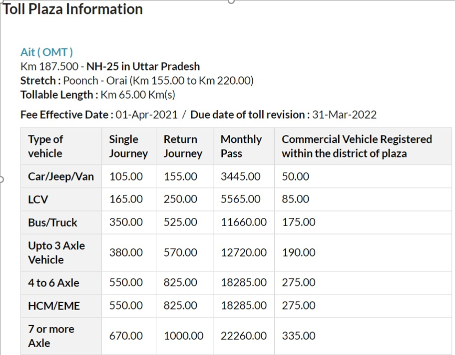

# Vehicle-Class-Detection-for-FastTag
<h2><b>Machine Leaning module to detect vehicle class to avoid FastTag frauds.</b></h2>
<h3><b>Problem Statement</b></h3>
<ul>
    <li>NHAI has started the implementation of FASTag compulsory for commercial and non-commercial vehicles.
         The main aim of the implementation behind the usage of RFID-based FASTag is to ensure the free movement of traffic without the need for stoppages at the toll gate.
    </li>
    <li>
        However, with the implementation of this technology, there are some people who have started to misuse the faults in the system. 
    </li>
    <li>
        The project aims to counter one of such problems by using machine learning based object recognition to classify the vehicle, then to compare the information on the RFID card to the vehicle class.
    </li>
    <li>
        The NHAI has divided all the vehicles into seven different catergories. Based on different categories, different toll is charged. 
        The FastTag stores the information about the vehicle class. 
    </li>
     

  

    <li>
        When the RFID scanner scans the FastTag at the toll plaza, it deducts the toll from the account as per the vehicle class stored in the FastTag.
    </li>
    <li>
        So if a truck driver somehow uses a FastTag with vehicle class Car, he/she will end up paying much less toll.
    </li>
     

  

    <li>
        So this way many people were able to fraud the highway authority and saving their money. A toll price list for different vehicles is mentioned below.
    </li>
</ul>

 

<h3><b>Solution</b></h3>
<ul>
    <li>
        The very obvious solution for the problem is to appoint a toll operator at every toll booth who will verify that class mentioned on FastTag is same as that of the vehicle.
    </li>
    <li>
        But this solution rules out the idea of using FastTag. FastTag were designed to computerize the toll operations thus easing the traffic at toll plaza. 
    </li>
    <li>
        So we came up with a machine learning soution for the detecting the vehicle class (based on axle count and vehicle category).
    </li>
    <li>
        Then the software will compare the vehicle class stored on the FastTag with the output of the model. If they comes out to be different, a warning/alarm will be raised.
    </li>
</ul>

 
<h3><b>About The Code</b></h3>
<ul>
    <li>
        The project is based on FasterRCNN+InceptionResNet-V2 module. The model is taken from Tensorflow Hub which is a repository for hundreds of pre-trained models, Ref - <a href="https://tfhub.dev/google/faster_rcnn/openimages_v4/inception_resnet_v2/1">https://tfhub.dev/google/faster_rcnn/openimages_v4/inception_resnet_v2/1</a> 

    </li>
    <li>
        The model is based on Faster R-CNN concept and was trained on “Open Images V4 with ImageNet” dataset which contains of 1000 different classification labels.
    </li>
    <li>
        The model file comprises of a 260 MB .pb file which shall be loaded into the memory for processing the images. The model took about 1-2 minutes to load on NVIDIA GTX 1650 GPU. The model gave predictions for images of normal size in about 2-4 seconds. 
    </li>
    <li>
        This model is used to detect the vehicle category (i.e. bus, truck, car, etc) and count to the number of axles in order to differentiate between different vehicle classes.
    </li>
    <li>Some outputs can be seen below - </li>
     

  
    

    
     

  

</ul>
 
<h3><b>Future Scope</b></h3>
<ul>
    <li>
        While making this project, ease of accessibility and user-friendliness were kept in mind so that the project can be implemented on the ground. 
    </li>
    <li>
        Through thorough research, it was found that using the software-based approach for doing repetitive tasks decreases the burden from the system, and automating those increases efficiency. 
    </li>
    <li>
        Thus, an application like this can prove to be time-saving for the people thereby increasing efficiency by reducing the time taken stopping on the toll gates and removing it.
    </li>
    <li>
        The model needs to be improved on some aspects, such as avoiding duplicate counting of axle, more accurate detection of vehicle catergory, time taken for detection, etc.
    </li>
</ul>
